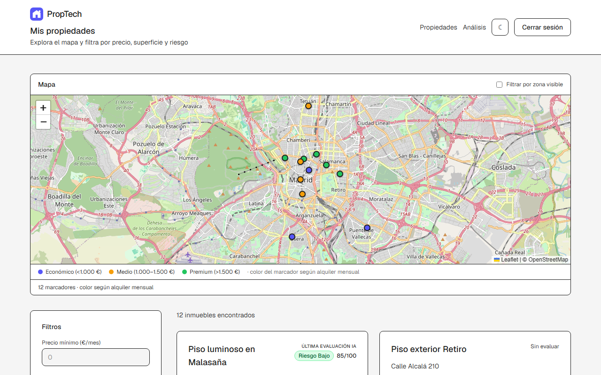
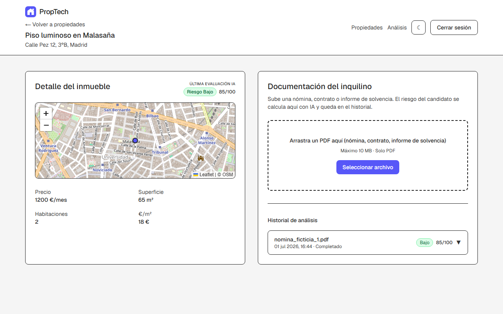
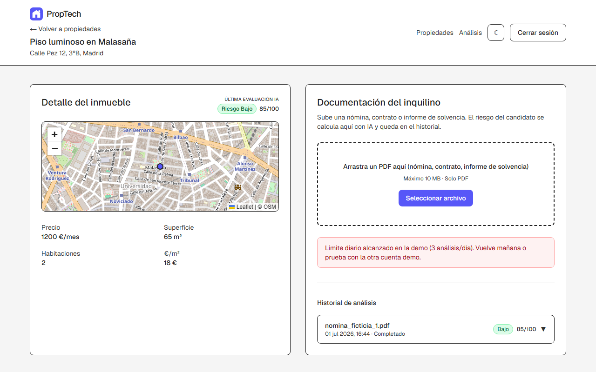

# PropTech — Plataforma SaaS de Inteligencia Inmobiliaria

Monorepo con frontend Next.js, API Express, Supabase (PostgreSQL + RLS + Auth) y servidor MCP para análisis de documentos con IA.

**Demo en vivo:** [https://proptech-web-kappa.vercel.app](https://proptech-web-kappa.vercel.app)

## Capturas

| Dashboard + mapa | Ficha con fotos e IA | Análisis PDF |
|------------------|----------------------|--------------|
|  |  |  |

## Stack

| Capa | Tecnología |
|------|------------|
| Frontend | Next.js 15+, TypeScript, Tailwind, Leaflet |
| API | Express + Zod + rate limiting |
| Base de datos | Supabase PostgreSQL + RLS + PostGIS |
| IA | MCP + Google Gemini (async) |
| Infra | Docker Compose, Terraform, Cloud Run + Vercel |

## Estructura

```
apps/web          → Frontend (mapa, dashboard, análisis)
apps/server       → API REST (Express)
services/mcp-ai   → Análisis IA con Gemini
packages/shared   → Schemas Zod compartidos
supabase/         → Migraciones SQL y seed
infra/terraform/  → Cloud Run (GCP)
docs/             → Guías de despliegue
```

## Requisitos previos

- Node.js 20+
- pnpm 9+
- Cuenta [Supabase](https://supabase.com)
- Docker (opcional, para compose)

## Configuración

1. Clona el repositorio e instala dependencias:

```bash
pnpm install
```

2. Configura `.env` en la raíz (copia desde `.env.example`) y `apps/web/.env.local` (copia desde `apps/web/.env.example`). Next.js solo lee variables `NEXT_PUBLIC_*` desde `apps/web/`.

3. Compila el paquete compartido:

```bash
pnpm --filter @proptech/shared build
```

## Desarrollo local

```bash
pnpm dev
```

- Frontend: http://localhost:3000
- Server: http://localhost:3001/health
- MCP-AI: http://localhost:3002/health

### Local vs producción

| Variable | Desarrollo local | Producción (Cloud Run) |
|----------|------------------|------------------------|
| `DAILY_ANALYSIS_QUOTA` | `0` (sin límite) | `3` |
| Registro | Eliminado de la UI | Deshabilitado en Supabase |

### Variables obligatorias

- `SUPABASE_URL`, `SUPABASE_ANON_KEY`, `SUPABASE_SERVICE_ROLE_KEY`
- `GEMINI_API_KEY` — [Google AI Studio](https://aistudio.google.com/apikey)
- `INTERNAL_SERVICE_KEY` — clave compartida server ↔ mcp-ai

Modelos Gemini vigentes: `node scripts/list-gemini-models.mjs`

## Demo pública

### Cuentas de prueba

| Usuario | Organización | Propiedades |
|---------|--------------|-------------|
| `demo-a@test.com` | Inmobiliaria Centro | 12 |
| `demo-b@test.com` | Gestión Norte | 8 |

La contraseña se configura en `.env` (`DEMO_USER_PASSWORD` / `NEXT_PUBLIC_DEMO_PASSWORD`) y **no debe subirse al repositorio**.

El login muestra botones de acceso rápido para Demo A y Demo B. El registro no está disponible (Supabase sign-ups deshabilitado).

### Límites de protección

| Protección | Límite |
|------------|--------|
| Registro de usuarios | Deshabilitado en Supabase |
| Análisis IA | 3 por organización y día |
| Subidas PDF | 5 por usuario y hora |
| Platform admin | Sin cuota ni límite de subidas |
| API global | 100 peticiones / 15 min por IP |
| Archivos | Solo PDF válido (`%PDF-`), máx. 10 MB |

### Checklist antes de publicar

1. Supabase Auth → desactivar sign ups
2. Google AI Studio → alerta y tope de presupuesto (~10 €/mes)
3. GCP Billing → alerta de presupuesto en el proyecto
4. `DAILY_ANALYSIS_QUOTA=3` en Cloud Run (Terraform)

Guía GCP: **[docs/gcp-setup.md](docs/gcp-setup.md)**  
Guía deploy completa: **[docs/demo-deploy.md](docs/demo-deploy.md)**

Regenerar capturas: `pnpm screenshots` (requiere `DEMO_USER_PASSWORD` en `.env`).

## Docker Compose

```bash
docker compose up --build
```

Levanta server (`:3001`), mcp-ai (`:3002`) y web (`:3000`). Requiere `.env` configurado.

## Tests

```bash
pnpm --filter @proptech/server test
pnpm test:e2e
```

Incluye aislamiento RLS entre `demo-a` y `demo-b`, validación de PDF/cuotas y E2E Playwright (login → subir PDF → ver resultado).

Variables E2E: `DEMO_USER_PASSWORD` (obligatoria), `E2E_BASE_URL` (opcional, default `http://localhost:3000`).

## CI

GitHub Actions (`.github/workflows/ci.yml`): build, typecheck y tests en cada push/PR.

Para tests RLS en CI, configura secrets `SUPABASE_URL` y `SUPABASE_ANON_KEY`.

## Despliegue

- **GCP:** [docs/gcp-setup.md](docs/gcp-setup.md)
- **Backend:** Cloud Run — [infra/terraform/README.md](infra/terraform/README.md)
- **Frontend:** Vercel — [docs/demo-deploy.md](docs/demo-deploy.md)

Script usuarios demo: `node scripts/setup-demo-users.mjs`

## Funcionalidades MVP

- Auth Supabase + multi-tenancy (RLS)
- Dashboard con filtros y **mapa Leaflet** (filtro por zona visible)
- Fichas con fotos (carrusel), descripción y evaluación IA
- Detalle de propiedad + upload PDF
- Análisis IA async (Gemini) con polling
- Historial de análisis + enlace desde listado global
- Panel **platform admin** cross-org
- Modo oscuro según preferencia del sistema
- Modo demo con rate limits y cuotas

## Documentación

- [Arquitectura](docs/architecture.md)
- [Despliegue GCP](docs/gcp-setup.md)
- [Despliegue demo (Vercel)](docs/demo-deploy.md)
- [Requisitos](docs/requirements.md)
- [AGENTS.md](AGENTS.md)
- [DESIGN.md](DESIGN.md)

## Licencia

Proyecto de portfolio — uso educativo.
