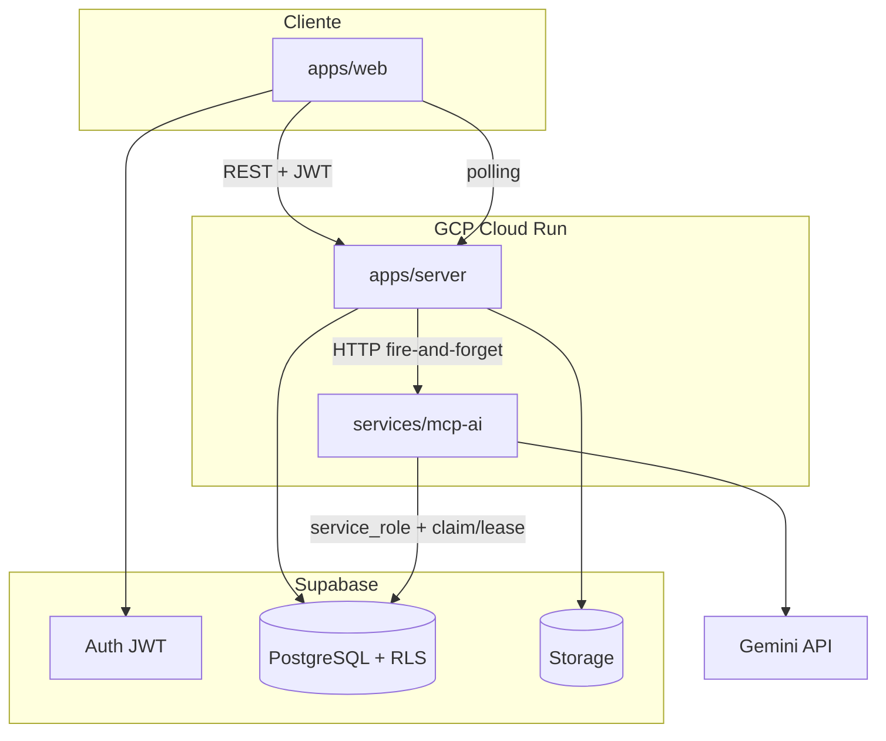

# Arquitectura — PropTech

## Visión general

Plataforma SaaS multi-tenant para agencias e inversores inmobiliarios. Cada organización ve únicamente sus datos gracias a Row-Level Security en PostgreSQL.

## Capas del backend (apps/server)

Arquitectura en capas ligera — no hexagonal completa:

| Capa | Responsabilidad |
|------|-----------------|
| `routes/` | HTTP delgado, parseo, respuestas |
| `services/` | Orquestación de lógica de negocio |
| `repositories/` | Acceso a Supabase |
| `middleware/` | Auth JWT, manejo de errores |

## Multi-tenancy

- Tenant = `organizations`
- Usuarios vinculados vía `organization_members`
- RLS: `organization_id IN (SELECT private.user_organization_ids())`
- La API usa el JWT del usuario → Supabase aplica RLS automáticamente
- `member` conserva lectura e inserción del flujo de upload; las operaciones
  destructivas requieren `private.user_is_org_admin(...)`.

## Flujo IA (implementado)

1. Usuario sube PDF con `Idempotency-Key` → server guarda temporalmente en Storage
2. RPC atómica valida propiedad, cuota e idempotencia y crea metadata + análisis
   `status=pending` → responde **202**; la cuota normal de tres análisis diarios
   se impone en PostgreSQL y no acepta un límite superior enviado por el cliente
3. Server dispara `POST /analyze` a mcp-ai (fire-and-forget)
4. mcp-ai reclama el análisis con un lease; jobs abandonados se recuperan y no se
   procesan concurrentemente
5. mcp-ai descarga PDF, llama Gemini, valida Zod, actualiza Supabase
6. Frontend hace polling a `GET /analyses/:id` cada 2s

## Mapa (Leaflet)

- Dashboard con mapa OpenStreetMap y marcadores por nivel de riesgo
- Filtro opcional por bounding box (`bbox=minLng,minLat,maxLng,maxLat`)
- PostGIS en BD para índice geográfico; filtro vía lat/lng en API

## Despliegue

- **Local:** `pnpm dev` o `docker compose up`
- **GCP:** Terraform en `infra/terraform/` (Cloud Run server + mcp-ai)
- **CI:** GitHub Actions — build, typecheck, tests RLS, contratos de infraestructura
  y auditoría de dependencias

## Decisiones documentadas

Ver `docs/adr/` para decisiones arquitectónicas formales.
